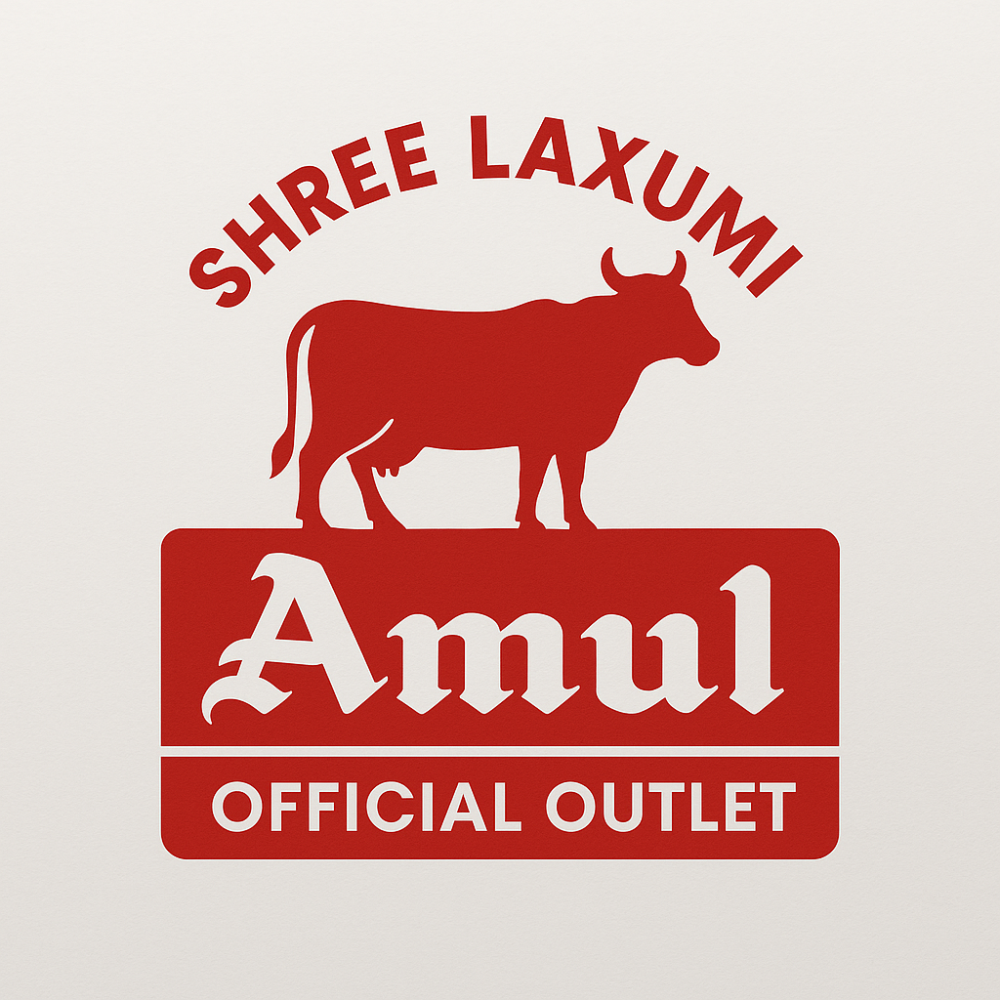

# Shree Laxmi Amul Shopiee - Official Website



A professional website for Shree Laxmi Amul Shopiee, an authorized Amul outlet located in Pachmarg, Maharashtra. This website showcases the store's products, services, and provides an easy way for customers to get in touch.

## 🌐 Live Website

The website is hosted on multiple platforms for reliability:

- Primary: [shreelaxmiamul.fast-page.org](https://shreelaxmiamul.fast-page.org)
- Secondary: [shreelaxmiamul.byethost33.com](http://shreelaxmiamul.byethost33.com)
- Tertiary: [shreelaxmiamul.ct.ws](https://shreelaxmiamul.ct.ws)

## ✨ Features

- **Modern Responsive Design**: Fully responsive website that works on all devices
- **Product Showcase**: Comprehensive display of Amul products offered at the store
- **Contact & Enquiry Forms**: Easy ways for customers to get in touch
- **Interactive Gallery**: Visual tour of the store and products
- **Store Information**: Business hours, location with map integration, and services
- **Nutritional Information**: Detailed nutritional data for Amul products
- **FSSAI Certification**: Display of food safety certification
- **WhatsApp Integration**: Direct messaging capability for quick customer inquiries

## 🛠️ Technologies Used

- HTML5, CSS3, JavaScript
- PHP for backend functionality
- Bootstrap 5 for responsive design
- AOS (Animate On Scroll) library for animations
- Google Maps integration
- Mobile-first approach for responsive design

## 🔧 Local Development Setup

To set up this project locally:

1. Clone the repository to your local XAMPP htdocs folder:
   ```
   git clone [repository-url] c:\xampp\htdocs\Amul-Shop
   ```

2. Start Apache server in XAMPP

3. Access the website at `http://localhost/Amul-Shop/`

## 📞 Contact Information

If you encounter any issues with the website or have questions about the store:

- **Owner Contact**: +91 9028915605
- **Email**: omspradippatil@gmail.com
- **Store Phone**: +91 9890377098
- **Store Address**: 210, pachmarg road, opp. police station, Delwadi, Kudan, Maharashtra 401502

## 📄 License

This project is licensed under the MIT License - see the [LICENSE](LICENSE) file for details.

## 🙏 Acknowledgments

- Amul (GCMMF) for providing official branding materials
- Bootstrap team for the responsive framework
- All customers who continue to support Shree Laxmi Amul Shopiee

---

© 2023 Shree Laxmi Amul Shopiee. All Rights Reserved.
